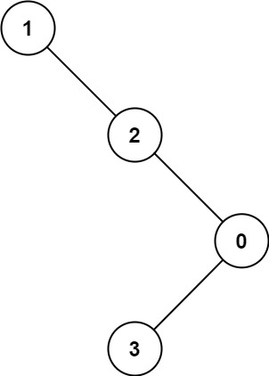

## 题目
给定二叉树的根节点 root，找出存在于 不同 节点 A 和 B 之间的最大值 V，其中 V = |A.val - B.val|，且 A 是 B 的祖先。

（如果 A 的任何子节点之一为 B，或者 A 的任何子节点是 B 的祖先，那么我们认为 A 是 B 的祖先）
### 示例 1：

> 输入：root = [8,3,10,1,6,null,14,null,null,4,7,13]  
> 输出：7  
> 解释：   
> 我们有大量的节点与其祖先的差值，其中一些如下：  
> |8 - 3| = 5  
> |3 - 7| = 4  
> |8 - 1| = 7  
> |10 - 13| = 3  
> 在所有可能的差值中，最大值 7 由 |8 - 1| = 7 得出。
### 示例 2：

> 输入：root = [1,null,2,null,0,3]
> 输出：3
### 提示：
> - 树中的节点数在 2 到 5000 之间。
> - 0 \<= Node.val \<= 10^5
## 题目说明
难度：中等；标签：树，深度优先搜索，二叉树
## 我的题解
### 代码(java)
```java
/**
 * Definition for a binary tree node.
 * public class TreeNode {
 *     int val;
 *     TreeNode left;
 *     TreeNode right;
 *     TreeNode() {}
 *     TreeNode(int val) { this.val = val; }
 *     TreeNode(int val, TreeNode left, TreeNode right) {
 *         this.val = val;
 *         this.left = left;
 *         this.right = right;
 *     }
 * }
 */
class Solution {
    int res = 0;
    public int maxAncestorDiff(TreeNode root) {
        maxAncestorDiff(root, new int[]{root.val, root.val});
        return res;
    }

    private void maxAncestorDiff(TreeNode p, int[] minmax) {
        if(minmax[1] - minmax[0] > res) res = minmax[1] - minmax[0];
        if(p.left != null && p.right != null) {
            int[] newMM = new int[]{minmax[0], minmax[1]};
            int lv = p.left.val;
            minmax[0] = Math.min(minmax[0], lv);
            minmax[1] = Math.max(minmax[1], lv);
            maxAncestorDiff(p.left, minmax);
            int lr = p.right.val;
            newMM[0] = Math.min(newMM[0], lr);
            newMM[1] = Math.max(newMM[1], lr);
            maxAncestorDiff(p.right, newMM);
        }else if(p.left != null) {
            int lv = p.left.val;
            minmax[0] = Math.min(minmax[0], lv);
            minmax[1] = Math.max(minmax[1], lv);
            maxAncestorDiff(p.left, minmax);
        }else if(p.right != null) {
            int lr = p.right.val;
            minmax[0] = Math.min(minmax[0], lr);
            minmax[1] = Math.max(minmax[1], lr);
            maxAncestorDiff(p.right, minmax);
        }
    }
}
```
### 代码说明
我的想法是从根到叶子递归遍历，要记录到当前结点时的最大最小值，然后这个差如果比结果大，替换结果，最后返回结果；注意到如果有两个子树，要复制一份最大最小值，如果只有一个子树，复用之前传进来的就可以了
## 官方题解
### 代码(java)
```java
class Solution {
    public int maxAncestorDiff(TreeNode root) {
        return dfs(root, root.val, root.val);
    }

    public int dfs(TreeNode root, int mi, int ma) {
        if (root == null) {
            return 0;
        }
        int diff = Math.max(Math.abs(root.val - mi), Math.abs(root.val - ma));
        mi = Math.min(mi, root.val);
        ma = Math.max(ma, root.val);
        diff = Math.max(diff, dfs(root.left, mi, ma));
        diff = Math.max(diff, dfs(root.right, mi, ma));
        return diff;
    }
}
```
### 代码说明
深度优先搜索，官方题解似乎比我的代码更不好理解，int diff = Math.max(Math.abs(root.val - mi), Math.abs(root.val - ma));这句是关键的计算最大差值的代码，这个diff可以理解成每个结点都计算了一下代入当前结点的最大差值（可能并不比之前的大），最终的最大差值，一定在这些计算的diff之中，与我的不同，我的是只计算到目前的最大差值，每次一定是目前为止最大的差值
## 最快题解
### 代码(java)
```java
```
### 代码说明
