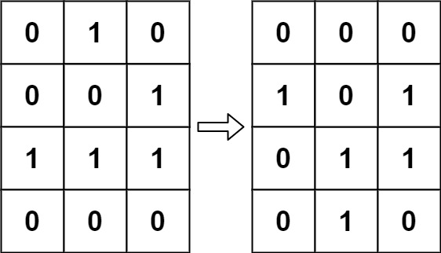

## 题目
> 根据 百度百科 ，生命游戏，简称为生命，是英国数学家约翰·何顿·康威在 1970 年发明的细胞自动机。
> 
> 给定一个包含 m × n 个格子的面板，每一个格子都可以看成是一个细胞。每个细胞都具有一个初始状态：1 即为活细胞（live），或 0 即为死细胞（dead）。每个细胞与其八个相邻位置（水平，垂直，对角线）的细胞都遵循以下四条生存定律：
> 
> 如果活细胞周围八个位置的活细胞数少于两个，则该位置活细胞死亡；  
> 如果活细胞周围八个位置有两个或三个活细胞，则该位置活细胞仍然存活；  
> 如果活细胞周围八个位置有超过三个活细胞，则该位置活细胞死亡；  
> 如果死细胞周围正好有三个活细胞，则该位置死细胞复活；  
> 下一个状态是通过将上述规则同时应用于当前状态下的每个细胞所形成的，其中细胞的出生和死亡是同时发生的。给你 m x n 网格面板 board 的当前状态，返回下一个状态。  
### 示例1：

### 示例2：

> 输入：board = [[1,1],[1,0]]  
> 输出：[[1,1],[1,1]]  
### 提示：
> m == board.length  
> n == board[i].length  
> 1 <= m, n <= 25  
> board[i][j] 为 0 或 1  
## 我的题解
### 代码(java)
```java
class Solution {
    public void gameOfLife(int[][] board) {
        if(board.length != 0 && board[0].length != 0){
            boolean[][] visited = new boolean[board.length][board[0].length];
            gameOfLife(board, 0, 0, visited);

            for(int i = 0; i < board.length; i++) {
                for(int j = 0; j < board[0].length; j++) {
                    board[i][j] >>= 1;
                }
            }
        }
    }
    
    private void gameOfLife(int[][] board, int x, int y, boolean[][] visited){
        if(!visited[x][y]){
            int sum = 0;
            visited[x][y] = true;

            if(x > 0){
                sum += board[x - 1][y] & 1;
                gameOfLife(board, x - 1, y, visited);
            }

            if(y > 0){
                sum += board[x][y - 1] & 1;
                gameOfLife(board, x, y - 1, visited);
            }


            if(x < board.length - 1){
                sum += board[x + 1][y] & 1;
                gameOfLife(board, x + 1, y, visited);
            }

            if(y < board[0].length - 1){
                sum += board[x][y + 1] & 1;
                gameOfLife(board, x, y + 1, visited);
            }


            if(x > 0 && y < board[0].length - 1){
                sum += board[x - 1][y + 1] & 1;
                gameOfLife(board, x - 1, y + 1, visited);
            }

            if(x < board.length - 1 && y > 0){
                sum += board[x + 1][y - 1] & 1;
                gameOfLife(board, x + 1, y - 1, visited);
            }

            if(x > 0 && y > 0){
                sum += board[x - 1][y - 1] & 1;
                gameOfLife(board, x - 1, y - 1, visited);
            }

            if(x < board.length - 1 && y < board[0].length - 1){
                sum += board[x + 1][y + 1] & 1;
                gameOfLife(board, x + 1, y + 1, visited);
            }
            
            // 00, 01, 10, 11：用两位表四种状态：第一位是原来的状态，第二位是更新后的状态
            if(sum == 3 || (sum == 2 && board[x][y] == 1)){
                board[x][y] = board[x][y] + 2;
            }
        }
    }
}
```
### 代码说明
使用visited数组记录是否访问过，用原数组记录新旧状态，00,01,10,11（0,1,2,3），低位是原状态，高位是新状态，周围八个方向深度搜索，这里要用到位运算的知识，当然这里visited数组可以省去，用原数组三位记录新旧状态与是否访问过，大家可以自己试一下
## 其它题解
### 代码(java)
```java
class Solution {
    private int m;
	private int n;

	public void gameOfLife(int[][] board) {
    	m = board.length;
    	n = board[0].length;
    	int[][]res=new int[m][n];
    	for (int i = 0; i < res.length; i++) {
			for (int j = 0; j < res[0].length; j++) {
				int cnt = dfs(board,i,j);
				if (board[i][j]==1) {
					if (cnt==2||cnt==3) {
						res[i][j]=1;
					}
				}else {
					if (cnt==3) {
						res[i][j]=1;
					}
				}
			}
		}
    	for (int i = 0; i < res.length; i++) {
			for (int j = 0; j < res[0].length; j++) {
				board[i][j]=res[i][j];
			}
			
		}
    }

	private int dfs(int[][] board, int row, int col) {
		// TODO Auto-generated method stub
		int cnt=0;
		int rowStart=Math.max(row-1, 0);
		int rowEnd=Math.min(row+1, m-1);
		int colStart=Math.max(col-1, 0);
		int colEnd=Math.min(col+1, n-1);
		for (int i = rowStart; i <= rowEnd; i++) {
			for (int j = colStart; j <=colEnd; j++) {
				if (i==row&&j==col) {
					continue;
				}
				if (board[i][j]==1) {
					cnt++;
				}
			}
		}
		return cnt;
	}
}
```
### 代码说明
大同小异，把visited数组换成了res数组来记当新状态，然后把res值赋给board
## 补充说明
内容来源于[晴雨](http://proprogrammar.com/article/841)