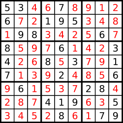

## 题目
> 编写一个程序，通过已填充的空格来解决数独问题。
> 
> 一个数独的解法需遵循如下规则：
> 
> 数字 1-9 在每一行只能出现一次。  
> 数字 1-9 在每一列只能出现一次。  
> 数字 1-9 在每一个以粗实线分隔的 3x3 宫内只能出现一次。  
> 空白格用 '.' 表示。  
>   
> 一个数独。  
>   
> 答案被标成红色。  
### Note:
> 给定的数独序列只包含数字 1-9 和字符 '.' 。  
> 你可以假设给定的数独只有唯一解。  
> 给定数独永远是 9x9 形式的。  
## 我的题解
### 代码(java)
```java
class Solution {
    char[][] board;
    boolean end;
    // 觉得dfs就可以了
    public void solveSudoku(char[][] board) {
        this.board = board;
        end = false;
        solveSudoku(0, 0, 0, 0);
    }

    private void solveSudoku(int i, int j, int m, int n){
        if(n < 3){
            if(board[i*3+m][j*3+n] != '.'){
                solveSudoku(i, j, m, n+1);
            }else{
                loop:
                for(char x = '1'; x <= '9'; x++){
                    for(int o = 0; o < 9; o++){
                        if(x == board[i*3+o/3][j*3+o%3] && (o / 3 != m || o % 3 != n))continue loop;
                        if(board[o][j*3+n] == x && o != i*3+m)continue loop;
                        if(board[i*3+m][o] == x && o != j*3+n)continue loop;
                    }

                    board[i*3+m][j*3+n] = x;
                    solveSudoku(i, j, m, n+1);
                    if(!end)board[i*3+m][j*3+n] = '.';
                }
            }
        }else if(m < 2){
            solveSudoku(i, j, m+1, 0);
        }else if(j < 2){
            solveSudoku(i, j+1, 0, 0);
        }else if(i < 2){
            solveSudoku(i+1, 0, 0, 0);
        }else{
            end = true;
        }
    }
}
```
### 代码说明
很标准的dfs了
## 其它题解
### 代码(java)
```java
class Solution {
    int N = 9, M = 1 << 9;
    int[] col = new int[N], row = new int[N];
    int[][] cell = new int[3][3];
    Map<Integer, Integer> map = new HashMap(16);
    Map<Integer, Integer> uMap = new HashMap(16);
    int[] one = new int[M];
    public void solveSudoku(char[][] a) {
        // 初始化，每个数字都可以取：0b111111111
        Arrays.fill(col, M - 1); Arrays.fill(row, M - 1);
        for(int i = 0; i < 3; i++) Arrays.fill(cell[i], M - 1);
        // 数字在0b111111111中的位置
        for(int i = 1; i <= 9; i++) map.put(i, 1 << (i - 1));
        // 0b111111111中的位置代表的数字
        for(int i = 1; i <= 9; i++) uMap.put(1 << (i - 1), i);
        int t = 0, res;
        for(int i = 1; i < M; i++){
            t = i;
            res = 0;
            while(t != 0){
                t -= lowBit(t);
                res++;
            }
            // 一个表示可取的数字的数的可取数字的数量，如0b100100101->4，即1，3，6，9可取
            one[i] = res;
        }
        int cnt = 0;
        for(int i = 0; i < 9; i++){
            for(int j = 0; j < 9; j++){
                if(a[i][j] != '.'){
                    // 更新行，列，3x3格子可取数字
                    draw(i, j, a[i][j] - '0', true, a);
                 // cnt是未填的数量
                }else cnt++;
            }
        }
        dfs(cnt, a);
    }

    public boolean dfs(int cnt, char[][] a){
        // 未填数量为0，结束
        if(cnt == 0){
            return true;
        }
        int and = 0, x = 0, y = 0, minOne = 10;
        for(int i = 0; i < 9; i++){
            for(int j = 0; j < 9; j++){
                if(a[i][j] != '.') continue;
                int t = row[i] & col[j] & cell[i / 3][j / 3];
                if(minOne > one[t]){
                    // 优化：每次从可填数字个数最少的格子开始填
                    minOne = one[t];
                    x = i; y = j;
                    and = t;
                }
            }
        }

        while(and != 0){
            int lowBit = lowBit(and);
            // 填数，更新行，列,3x3可填数字
            draw(x, y, uMap.get(lowBit), true, a);
            if(dfs(cnt - 1, a)) return true;
            // 当前数字不可用，恢复，更新行，列,3x3可填数字
            draw(x, y, uMap.get(lowBit), false, a);
            // 当前数字不可用，去掉
            and -= lowBit;
        }
        return false;
    }

    public void draw(int i, int j, int num, boolean add, char[][] a){
        int digit = map.get(num);
        if(add){// 填数
            a[i][j] = (char)(num + '0');
        }else{// 恢复
            a[i][j] = '.';
            digit = -digit;
        }
        row[i] -= digit;
        col[j] -= digit;
        cell[i / 3][j / 3] -= digit;
    }
    
    // 取最低位1，如0b110011000->0b1000
    public int lowBit(int x){
        return x & -x;
    }
}
```
### 代码说明
这个看起来很复杂，但是很快，解释在代码里，主要是把一个未填的格子可取的数字（状态）存在一个int中（低9位每一位代表从1~9的一个数，1可取，0不可取），优化在于每次从可取数字最少的未填格子开始填数字，注意：请先学一下lowBit这个方法，用来取一个数的最低位1，如0b1100，lowBit(0b1100)->0b100
## 补充说明
内容来源于[晴雨](http://proprogrammar.com/article/828)